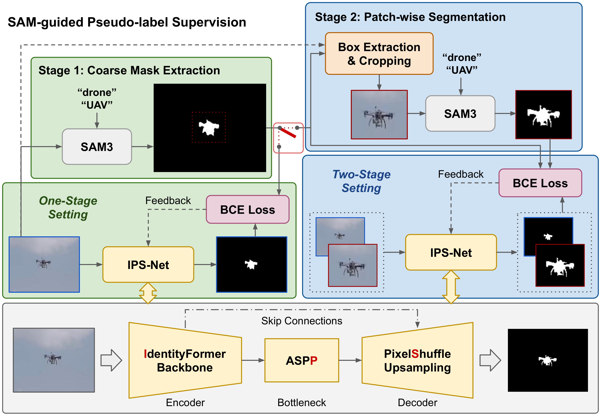
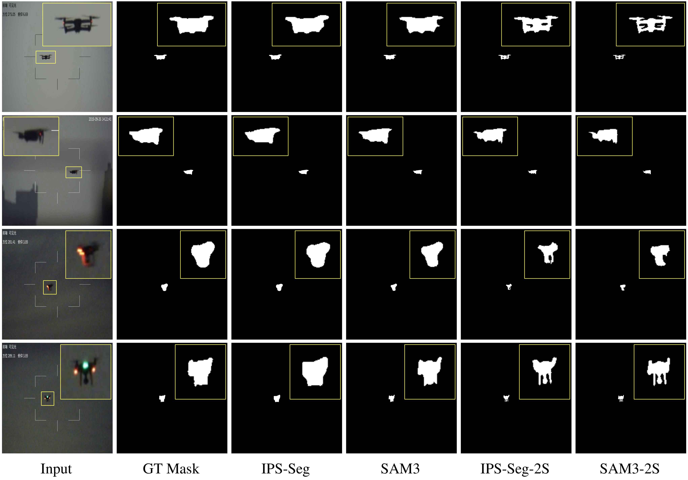

# IPS-Seg

[](https://arxiv.org/html/2607.03754v1)
[](https://huggingface.co/tranleanh/ips-seg)

Exploring SAM Supervision for Fine-Grained UAV Target Segmentation under Data Scarcity

Author: Le-Anh Tran

## Framework

<p align="center">

</p>

## Inference
### Setup
```bash
# Clone this repo
git clone https://github.com/tranleanh/ips-seg
cd ips-seg

# Create env and activate it
conda create -n ipsseg python=3.10
conda activate ipsseg

# Install dependencies
pip install -r requirements.txt
```
### SAM3 (ultralytics)
- Download SAM3 weight file from [facebook/sam3](https://huggingface.co/facebook/sam3) and place it in "models".
- Run SAM3 (1/2-stage) on input folder "imgs/inputs" and save results to "imgs/outputs_sam3":
```bash
python inference_SAM3.py --in_dir imgs/inputs --out_dir imgs/outputs_sam3
```
- See more arguments in [inference_SAM3.py](https://github.com/tranleanh/ips-seg/blob/main/inference_SAM3.py)
### IPS-Seg
- Download model file from [tranleanh/ips-seg](https://huggingface.co/tranleanh/ips-seg) and place it in "models".
- Run IPS-Seg (1/2-stage) on input folder "imgs/inputs" and save results to "imgs/outputs_ipsseg":
```bash
python inference_IPSSeg.py --in_dir imgs/inputs --out_dir imgs/outputs_ipsseg
```
- See more arguments in [inference_IPSSeg.py](https://github.com/tranleanh/ips-seg/blob/main/inference_IPSSeg.py)
- 
## Training
- Prepare image and mask folders, each input-mask pair must have the same file name.
- Specify data paths in [train.py](https://github.com/tranleanh/ips-seg/blob/main/train.py): "volumes_path" & "labels_path".
- Specify other configurations in [train.py](https://github.com/tranleanh/ips-seg/blob/main/train.py).
- Run training code:
```bash
python train.py
```

## Results

<p align="center">

</p>

## Citation
```bibtex
@article{tran2026ipsseg,
  title={Exploring SAM supervision for fine-grained UAV target segmentation under data scarcity},
  author={Tran, Le-Anh},
  journal={arXiv preprint arXiv:2607.03754},
  year={2026}
}
```
Have fun!

LA Tran
